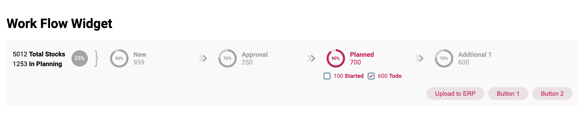

# Aifora Challenge
Aifora test to implement a reusable “Workflow” component that is flexible and adaptable using Angular 7.

	

## Content
Implement a reusable “Workflow” component that is flexible and adaptable. You should consider the following:
- [X] Component can be added to any page.
- [X] Component should have a clear Input/Output interface.
- [X] The selected bucket should be highlighted.
- [X] The number of buckets can change in the future.
- [X] The checkboxes can be different for each bucket.
- [X] There may be more buttons to place in the future.
